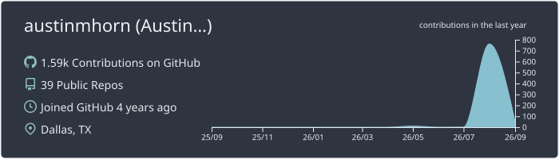

<h1 align="center">Austin Horn</h1>

  <b>C++ systems, game development, and cross-platform applications.</b> 
  Building deterministic gameplay systems, reusable libraries, and developer tooling across native desktop and the web.

  
  
  

  

---

## Featured Projects

### 🐍 Basilisk

**Pre-alpha deterministic C++ cave-hunting game engine** built around a shared rules core. The active `dev` branch targets native desktop, WebAssembly/browser builds, CLI and simulation clients, with an SDL3 graphical client in development.

`C++20` · `CMake` · `SDL3` · `WebAssembly` · `Simulation`

  

### 🚀 Space Wars

**Cross-platform C++/SFML game project** with CMake-based builds for macOS, Windows, and Linux.

`C++` · `CMake` · `SFML` · `Cross-platform`

  

### 🌿 leafy

**Lightweight C++ GUI library** providing reusable widgets, form components, custom shapes, resource management, and state-machine utilities.

`C++` · `CMake` · `SFML` · `GUI` · `Reusable library`

  

---

## GitHub Overview

  

  
  

---

## Current Stack

  
  
  
  
  
  
  
  
  

  
<b>Additional technologies</b>

   
  C · C# · Java · Lua · Swift · SQL · React · Django · Flutter · .NET · OpenGL · Firebase · MySQL · Microsoft SQL Server

 

  
<b>Background & Experience</b>

   

- **Software Developer Internship** — [Caffey Group](https://www.caffeygroup.com)
- **Senior Tech Lead** — [iCode](https://icodeschool.com)
- **Organizer** — [UNT Engineers United](https://unt.campuslabs.com/engage/organization/engineersunited)

---
